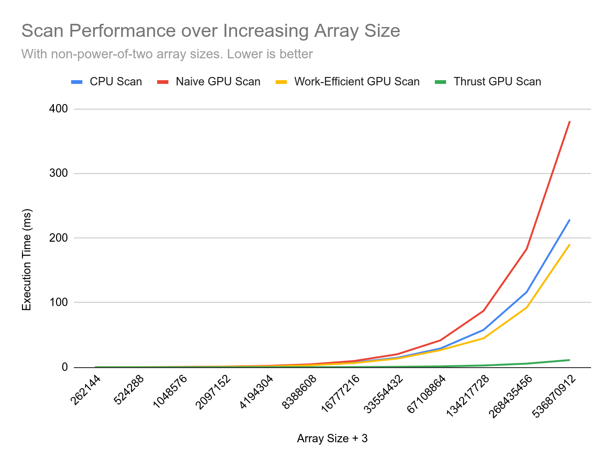
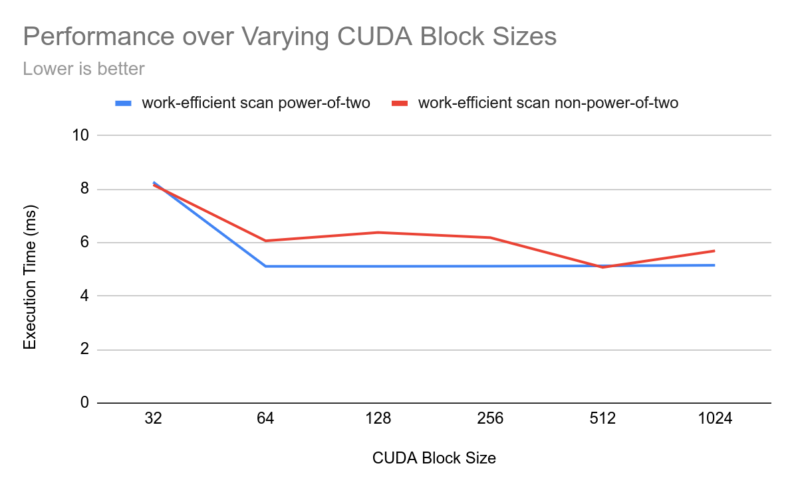
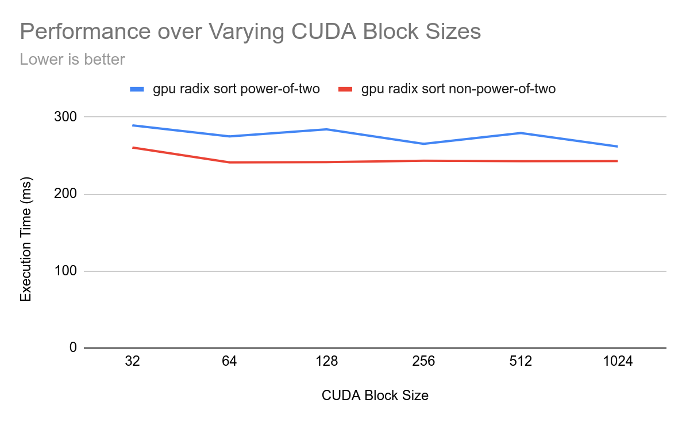

CUDA Stream Compaction
======================



(why is thrust so slow???)

**University of Pennsylvania, CIS 5650: GPU Programming and Architecture, Project 2**

* Thomas Shaw
  * [LinkedIn](https://www.linkedin.com/in/thomas-shaw-54468b222), [personal website](https://tlshaw.me), [GitHub](https://github.com/printer83mph), etc.
* Tested on: Fedora 42, Ryzen 7 5700x @ 4.67GHz, 32GB, RTX 2070 8GB


## Features

- CUDA exclusive scan and compaction implementations!
- Work-efficient algorithm speeds up scan even more!
  - Uses segmented blocks running in-place at the same time without worry of race condition, with arbitrary size input... can be adapted to use shared memory!
- Faster scan than CPU!!
- GPU Radix Sort implementation
  - (tested against CPU version in `main`)
- Python [analysis module](./analysis/README.md) for spitting out nice CSV files measuring performance


## Performance Analysis

Python scripts have been created in `analysis/` for easier stat collection. The [README](./analysis/README.md) within provides info on how to run these.

### Block Size Optimizations

Let's take a look at the resulting performance from block size choices, all normalized:


Performance seems to fluctuate differently per-algorithm between possible block sizes from 64 and 1024. 

See below all the different algorithms independently:
| | | |
|---|---|---|
|   Naive Scan |  Work Efficient Scan |  Thrust Scan |
|  |  Stream Compaction (Work-Efficient Scan) |  Radix |

It seems that the optimal block size for this machine is somewhere between 128 and 512, but that really depends on the algorithm.

### Scan Implementation Comparisons

See below the performance change over different array sizes, when aligned with powers of 2, and when not.


Our Work-Efficient GPU Scan outperforms the Naive one at almost all array sizes. This is to be expected.

The CPU scan actually keeps up pretty well, but eventually falls significantly behind both GPU implementations.

It seems that Thrust is generally much slower than our solutions. This may be due to some overhead loading external libraries, or doing unnecessary copying which adds an extra O(n) time. Further research could be done here.

### Test output at n = 2^27

```
****************
** SCAN TESTS **
****************
    [  45   9  27  23   1  22  41  22  38  25  35  19  49 ...  35   0 ]
==== cpu scan, power-of-two ====
   elapsed time: 195.421ms    (std::chrono Measured)
    [   0  45  54  81 104 105 127 168 190 228 253 288 307 ... -1006580612 -1006580577 ]
==== cpu scan, non-power-of-two ====
   elapsed time: 195.83ms    (std::chrono Measured)
    [   0  45  54  81 104 105 127 168 190 228 253 288 307 ... -1006580641 -1006580637 ]
    passed 
==== naive scan, power-of-two ====
   elapsed time: 178.568ms    (CUDA Measured)
    passed 
==== naive scan, non-power-of-two ====
   elapsed time: 160.998ms    (CUDA Measured)
    passed 
==== work-efficient scan, power-of-two ====
   elapsed time: 151.997ms    (CUDA Measured)
    passed 
==== work-efficient scan, non-power-of-two ====
   elapsed time: 155.299ms    (CUDA Measured)
    passed 
==== thrust scan, power-of-two ====
   elapsed time: 1000.16ms    (CUDA Measured)
    passed 
==== thrust scan, non-power-of-two ====
   elapsed time: 999.244ms    (CUDA Measured)
    passed 

*****************************
** STREAM COMPACTION TESTS **
*****************************
    [   1   2   3   3   0   3   3   2   0   2   0   0   0 ...   3   0 ]
==== cpu compact without scan, power-of-two ====
   elapsed time: 342.001ms    (std::chrono Measured)
    [   1   2   3   3   3   3   2   2   3   1   3   2   3 ...   2   3 ]
    passed 
==== cpu compact without scan, non-power-of-two ====
   elapsed time: 342.025ms    (std::chrono Measured)
    [   1   2   3   3   3   3   2   2   3   1   3   2   3 ...   1   1 ]
    passed 
==== cpu compact with scan ====
   elapsed time: 1084.35ms    (std::chrono Measured)
    [   1   2   3   3   3   3   2   2   3   1   3   2   3 ...   2   3 ]
    passed 
==== work-efficient compact, power-of-two ====
   elapsed time: 218.355ms    (CUDA Measured)
    passed 
==== work-efficient compact, non-power-of-two ====
   elapsed time: 170.299ms    (CUDA Measured)
    passed 

*****************************
** RADIX SORT TESTS **
*****************************
    [  26  47  38  48  23  28  48  10   6   9  30  37  21 ...  17   0 ]
==== cpu sort, power-of-two ====
   elapsed time: 17055.4ms    (std::chrono Measured)
    [   0   0   0   0   0   0   0   0   0   0   0   0   0 ...  49  49 ]
==== cpu sort, non-power-of-two ====
   elapsed time: 17048.5ms    (std::chrono Measured)
    [   0   0   0   0   0   0   0   0   0   0   0   0   0 ...  49  49 ]
==== gpu radix sort, power-of-two ====
   elapsed time: 5650.03ms    (CUDA Measured)
    [   0   0   0   0   0   0   0   0   0   0   0   0   0 ...  49  49 ]
    passed 
==== gpu radix sort, non-power-of-two ====
   elapsed time: 5632.99ms    (CUDA Measured)
    [   0   0   0   0   0   0   0   0   0   0   0   0   0 ...  49  49 ]
    passed 
```

### Radix Sort GPU implementation

As seen above in the above output, the GPU Radix sort implementation is significantly faster than the CPU implementation at larger n values. For further research, it should be compared with Quicksort, or some other famous CPU sorting algorithm.