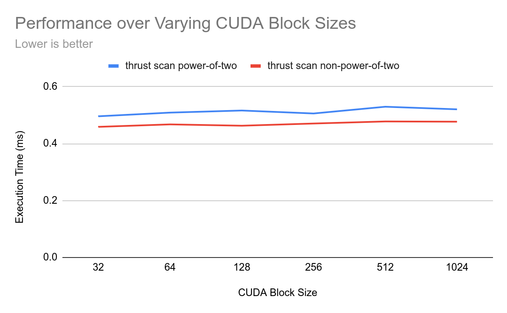

CUDA Stream Compaction
======================

(why is thrust so slow???)

**University of Pennsylvania, CIS 5650: GPU Programming and Architecture, Project 2**

* Thomas Shaw
  * [LinkedIn](https://www.linkedin.com/in/thomas-shaw-54468b222), [personal website](https://tlshaw.me), [GitHub](https://github.com/printer83mph), etc.
* Tested on: Fedora 42, Ryzen 7 5700x @ 4.67GHz, 32GB, RTX 2070 8GB

## Features

- CUDA exclusive scan and compaction implementations!
- Work-efficient algorithm speeds up scan even more!
- Faster scan than CPU!!
- GPU Radix Sort implementation
  - (tested against CPU version in `main`)

## Performance Analysis

Python scripts have been created in `analysis/` for easier stat collection. The [README](./analysis/README.md) within provides info on how to run these.

### Block Size Optimizations

Let's take a look at the resulting performance from block size choices, all normalized:

Performance seems to fluctuate differently per-algorithm between possible block sizes from 64 and 1024. 

See below all the different algorithms independently:
| | | |
|---|---|---|
|   Naive Scan |  Work Efficient Scan |  Thrust Scan |
|  |  Stream Compaction (Work-Efficient Scan) |  Radix |

It seems that the optimal block size for this machine is somewhere between 128 and 512, but that really depends on the algorithm.